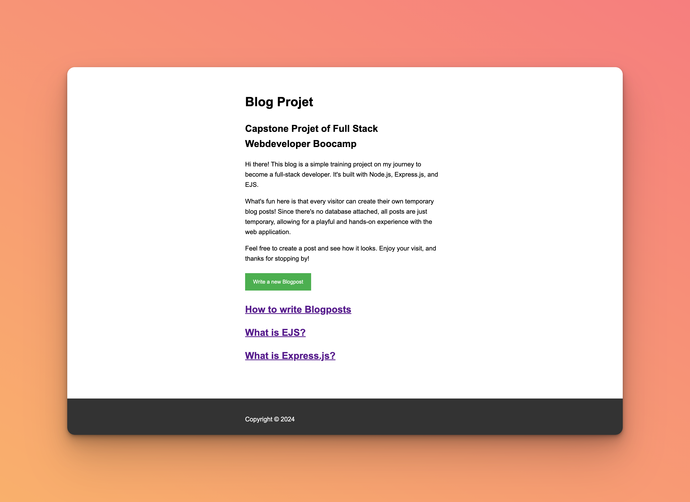
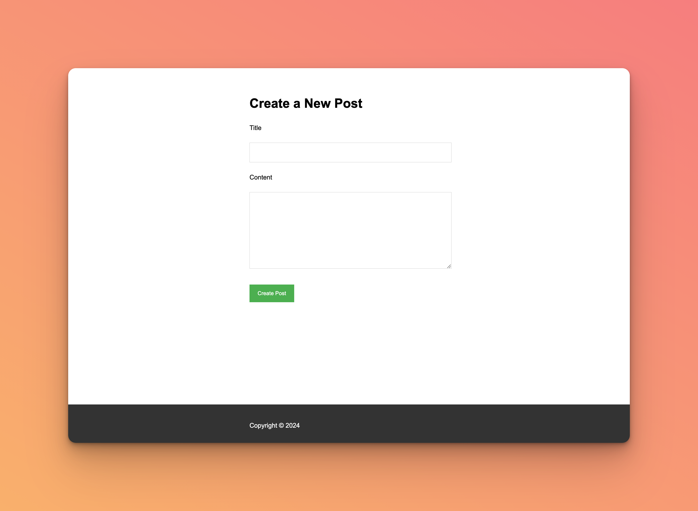
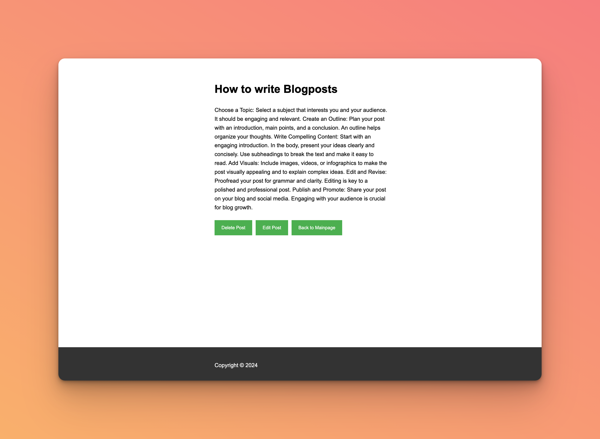
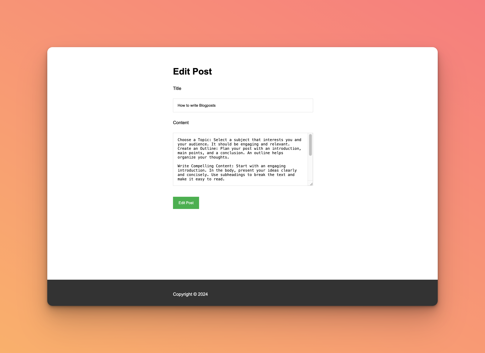

# Express EJS Blog Project

## Description

This project is a simple blog web application built using Express.js with EJS as the templating engine. It features the ability to create, read, update, and delete blog posts. The application serves as an introduction to CRUD operations in a web environment using Node.js and Express.







## Key Features
- **Blog Post Creation**: Users can write and post blogs.
- **Viewing Posts**: Display all blog posts on the home page.
- **Editing and Deleting**: Each post can be edited or deleted.
- **No Database**: Posts are temporary and not persisted (no database connected).

## Key Learnings

- **Express.js Fundamentals**: Gained a solid understanding of Express.js for server-side logic, including routing and middleware.
- **EJS Templating**: Learned to dynamically generate HTML content based on server data using EJS.
- **CRUD Operations**: Implemented Create, Read, Update, and Delete operations, simulating interactions with a database.
- **Form Handling**: Developed skills in managing form submissions and processing user input for blog creation and editing.

## Installation

Clone the repository:

```bash
git clone https://github.com/lappemic/udemy-capstone-2-blog.git
cd udemy-capstone-2-blog
npm install
```

## Usage

Start the server:

```bash
node index.js
```
or  nodemon
```bash 
nodemon index.js
```

Navigate to `http://localhost:3000` in your web browser to access the blog.

## Project Structure

- `index.js`: Main server file setting up Express, routes, and middleware.
- `views/`: Contains EJS templates for various parts of the blog (e.g., home page, individual post page, edit page).
- `public/`: Static files like stylesheets and client-side JavaScript.
